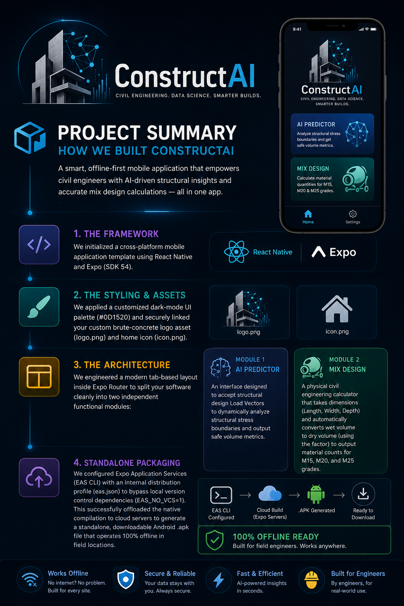

# 🏗️ ConstructAI



ConstructAI is a cross-platform mobile application engineered specifically for civil engineering professionals, site supervisors, and structural consultants. It streamlines field calculations by combining structural estimation tools with materials science tracking in a clean, offline-ready interface.

## 🚀 Core Features

* **Concrete Mix Design Calculator:** Fast, precision calculations for various concrete grades (e.g., M20, M25) adhering to standard engineering mix ratios.
* **Structural Load Vector Estimator:** Quick assessment tools for evaluating load distributions and structural vectors directly on-site.
* **On-Device Storage:** Safely log and review past calculation histories without requiring active internet connectivity.

## 🛠️ Technical Architecture

* **Framework:** React Native (Expo SDK 54) for native performance on Android & iOS.
* **Styling & UI:** Tailwind CSS (via NativeWind) / Custom Theme Constants for a clean, modern design layout.
* **Navigation:** Expo Router using robust file-based tab navigation.
* **Distribution:** Packaged via Expo Application Services (EAS) for seamless standalone builds.

## 📦 Local Installation & Development

To run this project locally on your machine for development:

1. Clone the repository and navigate to the project directory.
2. Install the necessary project dependencies:
   ```bash
   npm install
   ```
3. Start the local Expo development server:
   ```bash
   npx expo start
   ```
4. Scan the QR code using the **Expo Go** app on an Android device to test the live app.
